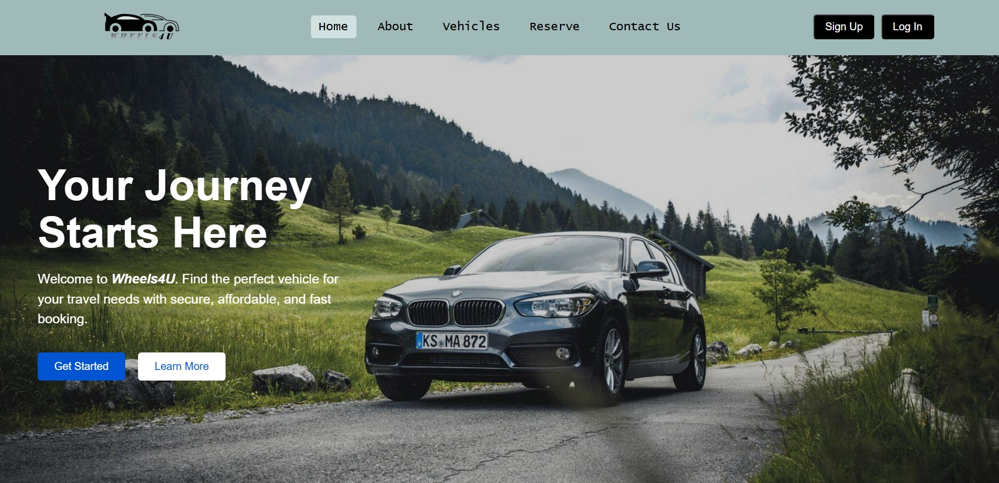

# 🚗 Wheels4U – Vehicle Rental Management System

  

---

## 🔹 Project Overview
**Wheels4U** is a web-based vehicle rental management system that allows users to search, book, and manage vehicles online.  
It provides an easy-to-use interface for customers and a robust admin panel to manage vehicles and user accounts.  
The system is built using **Java, JSP, Servlets, and MySQL**, ensuring reliable backend functionality and seamless front-end experience.  

**Key Uses:**  
- Manage vehicle rentals efficiently  
- Track available vehicles for users  
- Maintain user accounts securely  
- Streamline vehicle administration for admins
- Driver assignment and monitoring system 

---

## 🛠️ Features
- User registration, login, and profile management  
- Browse and search available vehicles  
- Book vehicles and manage reservations  
- Admin dashboard for managing vehicles and users  
- Real-time vehicle availability tracking  
- Responsive web design for easy navigation  

---

## 👩‍💻 My Contributions

### User Management
- Implemented **user registration and login system** with authentication  
- Enabled users to **book available vehicles**  
- Developed **profile management functionality** including profile updates  
- Implemented **password change and security validation**  
- Ensured seamless user experience and secure account handling  

### Vehicle Management
- Created **admin panel for vehicle management** (add, update, delete vehicles)  
- Enabled **users to view available and booked vehicles**  
- Developed **vehicle search and filtering** for easy browsing  
- Integrated **CRUD operations** for smooth vehicle data handling  
- Implemented **vehicle availability tracking** to prevent double booking  

> 🎬 **View project demo for my contributions:** [Wheels4U Demo Video](https://drive.google.com/file/d/1KBBBeKggtPFaHOOICxirRD_V3kvNdRoN/view?usp=sharing)

---

## 📊 Impact

- Simplified the vehicle rental process by allowing users to search and book vehicles online  
- Reduced manual handling of vehicle records through a database-driven system  
- Improved accuracy of bookings using basic vehicle availability tracking  
- Helped users manage their accounts easily with profile and password update features
- Organized vehicle, user, and driver data in a structured MySQL database

---

## 🧰 Tech Stack & Tools

**Programming Language:** Java  

**Web Technologies:** JSP, Servlets, HTML, CSS, JavaScript  

**Backend & Database:** MySQL  

**Database Tools:** MySQL Workbench  

**Development Tools:** Eclipse, Apache Tomcat, Git, GitHub

---
